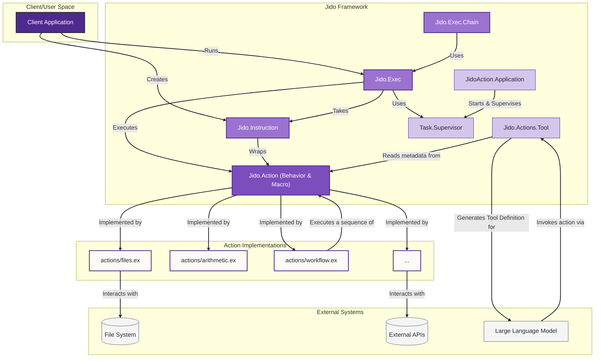
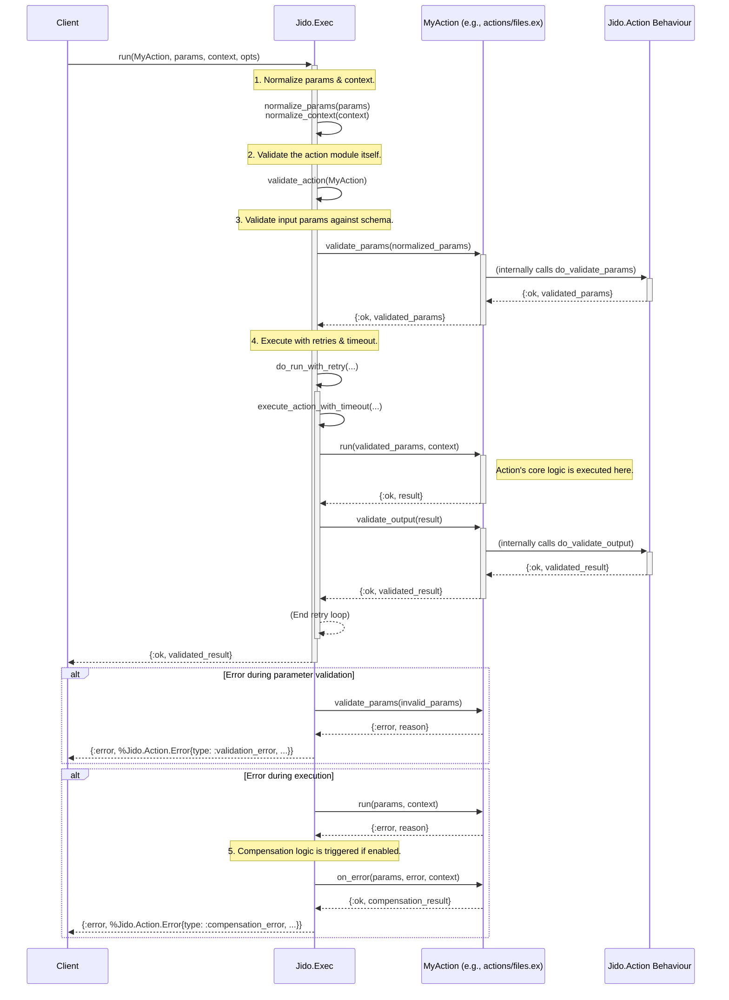
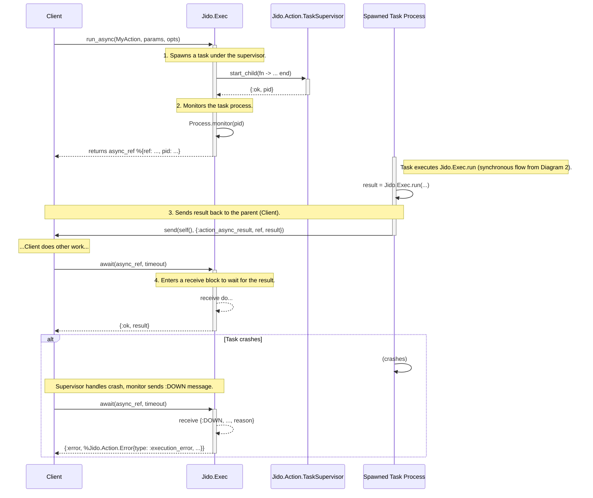
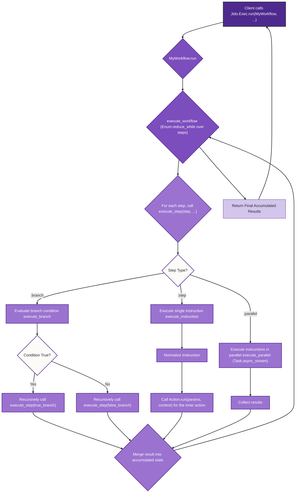
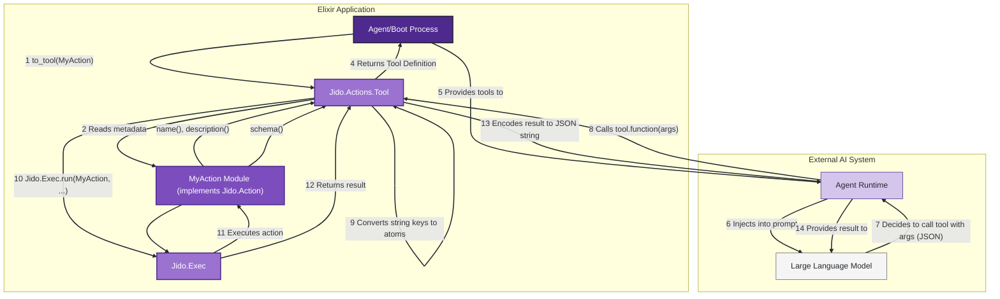

Of course. Here are the detailed architectural diagrams and explanations for the `jido_action` codebase.

### Introduction

The `jido_action` library provides a framework for defining, executing, and composing discrete units of work called **Actions**. The architecture is designed to be robust, featuring synchronous and asynchronous execution, error handling with retries and compensation, compile-time validation, and integration points for external systems like AI agents.

The core components are:
*   **`Jido.Action`**: A behavior and macro (`use Jido.Action`) for defining new actions. It standardizes an action's metadata, input/output schemas, and lifecycle callbacks.
*   **`Jido.Instruction`**: A standardized data structure representing a "work order." It wraps an `Action` with its specific `params`, `context`, and `opts` for execution.
*   **`Jido.Exec`**: The execution engine. It's the primary interface for running actions, handling the entire lifecycle including validation, timeouts, retries, telemetry, and asynchronous execution.
*   **Action Implementations**: Concrete modules (e.g., `Jido.Actions.Files`, `Jido.Actions.Arithmetic`) that `use Jido.Action` and implement the `run/2` logic.

---

### 1. High-Level Component Architecture

This diagram illustrates the main components of the `jido_action` framework and how they interact with each other and with external systems.

#### **Diagram Explanation:**

*   **Client Application**: The user of the framework. It interacts primarily with `Jido.Exec` to run actions and `Jido.Instruction` to define work orders.
*   **`Jido.Exec`**: The central execution engine. It's the main entry point for running any action. It uses a `Task.Supervisor` for asynchronous operations.
*   **`Jido.Instruction`**: A data structure that encapsulates an `Action` module along with its parameters and context, making actions portable.
*   **`Jido.Action` (Behavior & Macro)**: This is the heart of the framework. It's not a concrete module that gets called directly at runtime but a behavior that `Action Implementations` must adopt. The `use Jido.Action` macro injects common functionality like validation, metadata, and serialization into the action modules.
*   **Action Implementations**: These are the concrete Elixir modules (`jido_action/actions/*.ex`) that define the actual logic for a piece of work (e.g., writing a file, making an API call).
*   **`Jido.Exec.Chain`**: A utility that sits on top of `Jido.Exec` to run a sequence of actions, passing the output of one to the next.
*   **`Jido.Actions.Tool`**: A utility module that introspects an `Action`'s metadata and schema to generate a tool definition compatible with AI systems like OpenAI's function calling.
*   **OTP Integration**: The `JidoAction.Application` starts a `Task.Supervisor`, which is crucial for the asynchronous execution model provided by `Jido.Exec.run_async`.

---

### 2. Synchronous Action Execution Lifecycle

This sequence diagram details the steps involved when a client calls `Jido.Exec.run` to execute an action synchronously. It highlights the validation, execution, and error handling flow.

#### **Diagram Explanation:**

1.  **Normalization**: `Jido.Exec` first normalizes the `params` and `context` into a standard map format.
2.  **Action Validation**: It ensures the provided module is a valid, compiled action that implements the required `run/2` function.
3.  **Parameter Validation**: `Jido.Exec` calls `MyAction.validate_params/1`. This function, injected by `use Jido.Action`, validates the parameters against the `schema` defined in the action.
4.  **Execution with Policies**: The core execution happens within helpers that manage:
    *   **Retries**: `do_run_with_retry` will re-run the action on failure, up to `max_retries`.
    *   **Timeouts**: `execute_action_with_timeout` wraps the call in a process that will be terminated if it exceeds the specified timeout.
    *   **Telemetry**: Events are emitted at the start and end of execution.
5.  **Core Logic**: The action's specific `run/2` function is finally called.
6.  **Output Validation**: The result from `run/2` is validated against the `output_schema` (if defined).
7.  **Error & Compensation**: If `run/2` returns an error, `Jido.Exec` checks if compensation is enabled. If so, it calls the `on_error/4` callback on the action module, allowing for cleanup or rollback logic. The final error returned to the client is a `compensation_error`.

---

### 3. Asynchronous Action Execution Flow

This diagram shows how `Jido.Exec.run_async` works, leveraging an OTP `Task.Supervisor` to run actions in background processes without blocking the client.

#### **Diagram Explanation:**

1.  **Task Spawning**: `run_async` does not execute the action directly. Instead, it wraps the call to `Jido.Exec.run` in an anonymous function and passes it to `Task.Supervisor.start_child`. This creates a new process to do the work.
2.  **Monitoring**: The client's process (which called `run_async`) monitors the newly spawned task. This allows it to receive a `:DOWN` message if the task process crashes, preventing an indefinite wait.
3.  **Result Passing**: When the task finishes its work, it sends the result in a message tagged with a unique reference back to the original caller (`parent`).
4.  **Awaiting Result**: The `await` function is a blocking call that simply enters a `receive` block, waiting for one of three things:
    *   The success message with the result.
    *   A `:DOWN` message indicating the task crashed.
    *   A timeout, after which `await` will kill the task process and return a timeout error.

---

### 4. Workflow Action Architecture

The `Jido.Actions.Workflow` module provides a special type of action that executes a predefined sequence of other actions. This diagram shows its internal control flow.

#### **Diagram Explanation:**

A `Workflow` action is itself a standard action, but its `run` logic is a mini-interpreter for a list of steps.

1.  **Entry Point**: Execution starts like any other action via `Jido.Exec.run`.
2.  **`execute_workflow`**: The main loop iterates through the `@workflow_steps` defined in the module. It maintains an accumulator for parameters, which allows the output of one step to be used as input for the next.
3.  **`execute_step`**: This function acts as a dispatcher based on the step type (`:step`, `:branch`, etc.).
4.  **Step Execution**:
    *   **`:step`**: A standard, single action is executed.
    *   **`:branch`**: A condition is evaluated. Based on the result, the workflow recursively executes either the `true_branch` or `false_branch`, which are themselves steps. The condition can be a static value or a dynamic one resolved at runtime by overriding `execute_step`.
    *   **`:parallel`**: Executes multiple instructions concurrently, typically using OTP tasks, and waits for all to complete.
5.  **State Accumulation**: The result of each step is merged back into the `params` map, making it available to subsequent steps in the workflow.

---

### 5. AI Tool Integration Architecture

This diagram explains how a `Jido.Action` can be transformed into a "tool" that a Large Language Model (LLM) can understand and use.

#### **Diagram Explanation:**

1.  **Introspection**: At boot time, the `Jido.Actions.Tool.to_tool/1` function is called on an action module (`MyAction`).
2.  **Metadata Extraction**: `to_tool` reads the action's `name`, `description`, and `schema` using the functions defined by `use Jido.Action`.
3.  **Schema Conversion**: The `schema`, which is a `NimbleOptions` keyword list, is converted into a standard JSON Schema map. This involves mapping Elixir types (`:string`, `:integer`) to JSON Schema types (`"string"`, `"integer"`).
4.  **Tool Definition**: The function returns a map containing the `name`, `description`, and the generated `parameters` schema. This map is the "Tool Definition".
5.  **LLM Integration**: This tool definition is passed to an LLM, usually as part of the system prompt, so the model knows what functions it can call and what arguments they expect.
6.  **Function Calling**: When the LLM decides to use the tool, it generates a JSON object with the function name and arguments.
7.  **Execution**: The agent runtime calls the `function` specified in the tool definition. This function is an alias for `Jido.Actions.Tool.execute_action/3`.
8.  **Invocation**: `execute_action` takes the JSON arguments, converts them back into an Elixir map with atom keys, and uses `Jido.Exec.run` to execute the original `MyAction`.
9.  **Result Formatting**: The result from the action is encoded as a JSON string and returned to the LLM, completing the loop.
