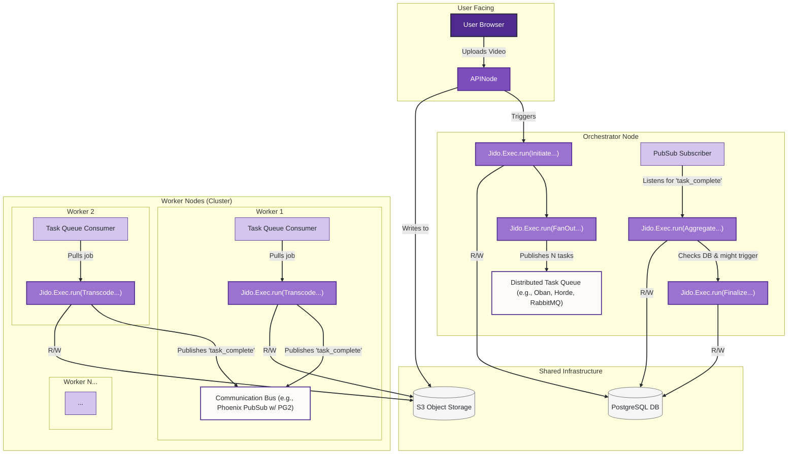

Of course. This is an excellent question, as it probes the boundaries and extensibility of the framework. Let's conceptualize a powerful distributed use case and analyze how `jido_action` fits in.

### Conceptual Use Case: Distributed Video Transcoding Pipeline

Imagine a platform like YouTube or Vimeo. When a user uploads a high-resolution video, it must be processed and transcoded into multiple formats and resolutions (e.g., 1080p, 720p, 480p, HLS segments) for adaptive bitrate streaming. This is a CPU-intensive, highly parallelizable task, making it a perfect candidate for a distributed cluster.

**The Goal:** To build a system that can take a single video upload and orchestrate its transcoding across a dynamic cluster of worker nodes.

**Key Components & Workflow:**

1.  **API Node:** A public-facing node that handles the initial video upload from a user and stores the raw file in a shared object storage (like AWS S3).
2.  **Orchestrator Node:** This node is responsible for managing the entire transcoding job. It might be the same as the API node or a dedicated internal node.
3.  **Worker Nodes:** A cluster of nodes whose sole purpose is to perform the heavy-lifting of transcoding. This cluster can scale up or down based on load.
4.  **Shared State:** A durable database (e.g., PostgreSQL) to track job status and a shared file storage (e.g., S3) for video files.

**The Actions:**

*   `InitiateTranscodingJobAction`:
    *   **Runs on:** Orchestrator Node.
    *   **Triggered by:** The API node after a successful upload.
    *   **Logic:** Creates a master `Job` record in the database with a "pending" status.
    *   **Output:** The `job_id`.

*   `FanOutTranscodingTasksAction`:
    *   **Runs on:** Orchestrator Node.
    *   **Triggered by:** The completion of `InitiateTranscodingJobAction`.
    *   **Logic:**
        1.  Reads the master job details.
        2.  Determines the required output formats (1080p, 720p, etc.).
        3.  For each format, it creates a "sub-task" and **dispatches it to the distributed cluster of worker nodes.** This is the critical distribution step.
    *   **Output:** A list of `sub_task_ids` that have been dispatched.

*   `TranscodeVideoSegmentAction`:
    *   **Runs on:** **Any Worker Node** in the cluster.
    *   **Triggered by:** Receiving a job from the distributed task system.
    *   **Logic:**
        1.  Downloads the source video from S3.
        2.  Executes `ffmpeg` (or a similar library) with the specified parameters (resolution, bitrate). This is a long-running, CPU-bound operation.
        3.  Uploads the resulting transcoded file to a "processed" bucket in S3.
        4.  **Reports the result** (success or failure) back to the orchestrator.

*   `AggregateResultsAction`:
    *   **Runs on:** Orchestrator Node.
    *   **Triggered by:** A completion event from a `TranscodeVideoSegmentAction`.
    *   **Logic:** Updates the status of the sub-task in the database. Checks if all sub-tasks for the master job are complete.
    *   **Output:** If all tasks are complete, it triggers the finalization step.

*   `FinalizeJobAction`:
    *   **Runs on:** Orchestrator Node.
    *   **Triggered by:** `AggregateResultsAction` when all sub-tasks are done.
    *   **Logic:** Marks the master job as "completed" in the database and perhaps sends a notification (e.g., to a WebSocket for the user's UI).

### Architectural Diagram for the Distributed System

This diagram shows how `jido_action` is integrated, not as the distribution mechanism itself, but as the engine for executing the work on each node.

### Analysis: Suitability, Wrappers, and Integrations

The analysis shows that `jido_action` is **not a distributed framework out-of-the-box**, but it is **exceptionally well-suited to be the standardized execution engine *within* a distributed architecture**.

Here’s a breakdown:

#### 1. What Works "As-Is" (Strengths to Leverage)

*   **Standardized Work Definition (`Jido.Action`):** The `TranscodeVideoSegmentAction` can be perfectly defined using `use Jido.Action`. Its `schema` will ensure that any worker node receiving the task gets validated parameters like `source_url`, `target_resolution`, `bitrate`, etc. This prevents errors deep within the cluster.
*   **Reliable Local Execution (`Jido.Exec`):** When a worker node picks up a task, it uses `Jido.Exec.run` to execute it. This provides immense value immediately:
    *   **Timeouts:** A transcoding job that gets stuck can be automatically killed.
    *   **Retries:** If a worker fails to download the video due to a transient network error, `Jido.Exec` can automatically retry the action.
    *   **Error Handling:** The structured `Jido.Action.Error` provides clear, serializable error information that can be sent back to the orchestrator.
*   **Orchestration Logic (`Jido.Actions.Workflow`):** The high-level process on the Orchestrator node (`Initiate` -> `FanOut` -> `Finalize`) can be cleanly modeled as a `Jido.Exec.Chain` or `Jido.Actions.Workflow`.

#### 2. What Needs to be Wrapped or Integrated (The Gaps to Fill)

The core `jido_action` framework has no concept of "nodes" or "remote execution." This is a design choice; it focuses on executing a task, not on where to execute it. To make our use case work, we need to **integrate** it with other parts of the Elixir/OTP ecosystem.

*   **Gap 1: Task Distribution**
    *   **Problem:** How does `FanOutTranscodingTasksAction` send a `TranscodeVideoSegmentAction` to a remote worker node? `Jido.Exec.run` is a local call.
    *   **Solution (Integration/Wrapping):** Integrate a distributed task processing library.
        *   **Option A (Job Queue):** Use a library like **Oban**. The `FanOut...Action` doesn't call `Jido.Exec.run` directly. Instead, it **wraps** the call by enqueuing a job in Oban: `MyApp.TranscoderWorker.new(%{action: TranscodeVideoSegmentAction, params: ...}) |> Oban.insert()`. On each worker node, an Oban worker process will pull jobs from the queue and then call `Jido.Exec.run` locally.
        *   **Option B (RPC/Dynamic Supervision):** Use a library like **Horde**. The `FanOut...Action` would use `Horde.Supervisor.start_child_on_node(node_id, child_spec)` to start a task on a specific worker. The child spec would define a process that calls `Jido.Exec.run`.

*   **Gap 2: Communication & Result Aggregation**
    *   **Problem:** How does a worker node report its result back to the orchestrator?
    *   **Solution (Integration):** Use a PubSub mechanism.
        *   **Phoenix.PubSub** with a distributed backend (like the built-in `PG2` or a Redis adapter) is the canonical solution in the Elixir ecosystem.
        *   The `TranscodeVideoSegmentAction`, upon completion, would publish a message: `Phoenix.PubSub.broadcast(MyApp.PubSub, "transcoding_events", {:task_complete, job_id, sub_task_id, result})`.
        *   The Orchestrator node would have a process (e.g., a GenServer) that subscribes to this topic. When it receives a message, it triggers the `AggregateResultsAction`.

*   **Gap 3: Service Discovery**
    *   **Problem:** How does the orchestrator know which nodes are available?
    *   **Solution (Integration):** This is handled by the distribution layer.
        *   **Horde** handles this automatically through its distributed registry. The orchestrator can query Horde for a list of available worker nodes.
        *   With **Oban**, the concept is inverted: workers pull jobs, so the orchestrator doesn't need to know about them directly. The scalability comes from adding more worker processes that connect to the same database.

### Summary: As-Is vs. Modified vs. Integrated

| Aspect | Framework's Role | Required Action |
| :--- | :--- | :--- |
| **Defining Work** | **As-Is.** The framework is perfectly suited. | None |
| **Executing Work Locally** | **As-Is.** The framework is perfectly suited. | None |
| **Distributing Work** | **N/A.** The framework is not designed for this. | **Integrate** with a distributed task library (Oban, Horde). **Wrap** the `Jido.Exec.run` call inside the worker process of that library. |
| **Cross-Node Communication** | **N/A.** The framework is not designed for this. | **Integrate** with a PubSub system (Phoenix.PubSub). Actions will publish events to this system. |
| **Durable State** | **N/A.** The framework is stateless. | **Integrate** with a database (e.g., PostgreSQL). Actions will read/write to this database. |

### Conclusion

The `jido_action` framework, **as-is**, is **not a distributed scheduling system, but rather a powerful, standardized *execution engine* for the tasks that a distributed system needs to run.**

It does not need to be **modified**. Its value lies in its focused scope. Instead, it should be **integrated** as a core component within a larger distributed architecture built with standard Elixir/OTP tools. The `Jido.Exec.run` call is "the last mile" of a distributed job, providing crucial guarantees of reliability, validation, and observability at the point of execution on each individual node.
